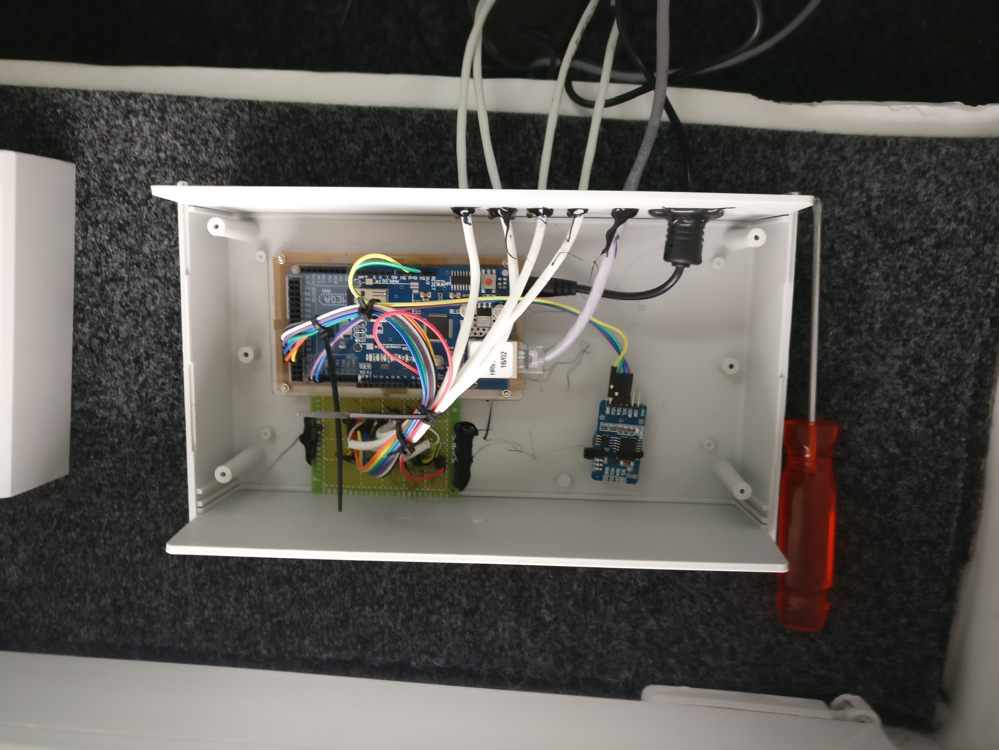
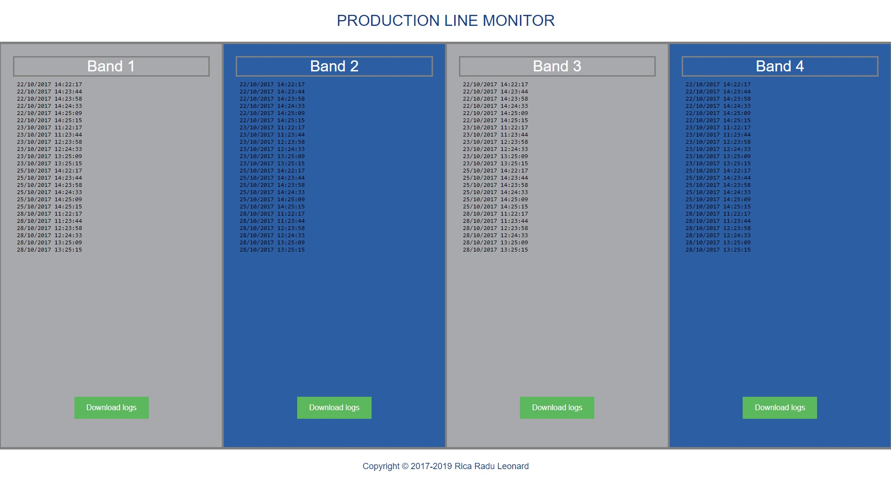

# Production-Line-Monitor

I developed this solution to monitor a production line in real time.

## Hardware
For input, you can use sensors of your choice, in this case I used 4 mechanical limit switches with rollers, with 4 pull-down resistors.

To know the date and time I used a real time clock module, namely RTC3231.

For the web server and data storage I used a W5100 Ethernet Shield, which also contains an SD card slot.

 
 
 ## Software
For the correct reading of the inputs, I debounced them.

I saved the captured data in real time on the SD card, in 2 different files for each sensor, a file that briefly describes the data, and a file with the complete logs.

The web server is able to display the summary files in the interface made in HTML, and the detailed files can also be downloaded from here.

 
 
